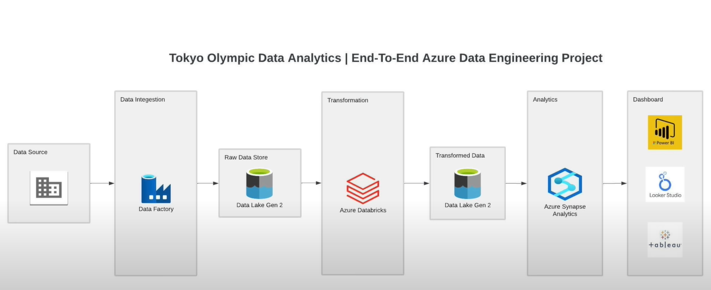

# Tokyo Olympic Data Analytics - End-to-End Azure Data Engineering Project

This project demonstrates a complete data engineering workflow using Microsoft Azure services to analyze Tokyo Olympic data. It covers the data ingestion, transformation, storage, querying, and visualization stages. The goal is to showcase data engineering best practices and provide insights into the Olympic data using different azure resources.

## Project Architecture

1. **Data Ingestion**: Data is extracted from GitHub using Azure Data Factory and stored in Azure Data Lake Storage Gen2 as raw data.
2. **Data Transformation**: 
   - The raw data is mounted in Azure Databricks.
   - A Spark instance is launched in Databricks to perform data transformations such as casting column data types and dropping unnecessary columns.
   - The transformed data is written back to the Data Lake in a separate "transformed data" folder.
3. **Data Storage and Querying**: 
   - Azure Synapse Analytics is used to create tables from the transformed data stored in Data Lake.
   - SQL queries are executed to further analyze and explore the data.
4. **Data Visualization**: Tableau is connected to Azure Synapse Analytics to create interactive dashboards for visual insights.

## Technologies Used

- **Azure Data Factory**: For orchestrating the data pipeline and moving data from GitHub to Azure Data Lake.
- **Azure Data Lake Storage Gen2**: To store both raw and transformed data.
- **Azure Databricks**: For data transformation using Apache Spark.
- **Azure Synapse Analytics**: For data querying and warehousing.
- **Tableau**: For data visualization and dashboard creation.

## Results and Insights

The final Tableau dashboards provide various insights into the Tokyo Olympics, including:
- Medal counts by country and event.
- Athlete performance across different disciplines.
- Trends and patterns in the competition.

## Architecture

 
